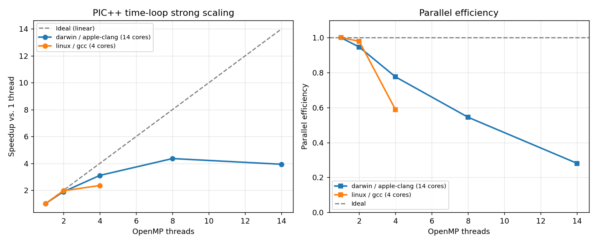

# PIC++

PIC++ is a **1D electrostatic Particle-in-Cell (PIC)** plasma simulator written in modern C++20. It models collisionless plasma dynamics by coupling a particle push with a spectral Poisson field solve. The hot particle kernels are **OpenMP-parallelized** over a cache-friendly Structure-of-Arrays layout, and the project includes regression tests, physics validation, benchmark inputs, and optional web visualization.

## Physics

The code implements a standard ES-PIC cycle:

1. **Deposit charge** — cloud-in-cell assignment of particle charge onto the grid
2. **Solve fields** — FFT-based Poisson solve for the electric potential and field
3. **Push particles** — leapfrog update of particle velocities and positions
4. **Repeat** for each time step

Supported benchmark problems include:

- **Two-stream instability** — counter-propagating cold beams (`inputFiles/validation/twoStreamInstability.json`, also `inputFiles/twoStream.json`)
- **Landau damping** — warm plasma with spatial perturbation (`inputFiles/validation/landauDamping.json`); cold control at `inputFiles/validation/coldPlasmaWave.json`
- **Web demos** — quick and full-resolution cases in `inputFiles/demo/` (loaded by the web UI)
- **Quick examples** — `inputFiles/exampleInput.json`, `inputFiles/landau.json`, `inputFiles/coldPlasma.json`

All simulations are driven by **JSON input files**.

See [docs/validation.md](docs/validation.md) for automated physics checks and validation plots.

## Build

Requires [Conan 2.x](https://conan.io/) and a C++20 compiler.

**Quick start:**

```bash
python3 -m venv .venv
.venv/bin/pip install "conan>=2.0" cmake
./scripts/build.sh
```

See [docs/building.md](docs/building.md) for Linux/Windows profiles, manual commands, and troubleshooting.

## Run

```bash
./build/bin/PIC++Main inputFiles/exampleInput.json
```

Write full time-series output (energies and phase frames) to a JSON file:

```bash
./build/bin/PIC++Main inputFiles/validation/twoStreamInstability.json build/validation_results.json
```

## Test

Tests run automatically during `conan build`, and can be re-run with:

```bash
ctest --test-dir build --output-on-failure
```

Run only validation tests:

```bash
./build/bin/PIC++Main_Test --gtest_filter="ValidationTest.*"
```

## Performance & parallelism

The particle push, charge deposition, and energy diagnostics are parallelized
with **OpenMP** over a Structure-of-Arrays particle layout. OpenMP is optional:
when it isn't found at configure time the code compiles and runs correctly in
serial. On an 800k-particle problem the time-integration loop reaches **~4.3×
speedup on 8 threads**:



Reproduce the strong-scaling sweep (requires an OpenMP-enabled build; run
`scripts/verify_openmp.sh` to confirm):

```bash
./scripts/scaling_benchmark.sh
.venv/bin/python scripts/plot_scaling.py
```

See [docs/performance.md](docs/performance.md) for the parallelization strategy
(including the race-free charge deposition) and full scaling analysis.

Benchmark inputs for parameter sweeps live under `inputFiles/benchmarkFiles/`. Use [hyperfine](https://github.com/sharkdp/hyperfine) to collect end-to-end timings:

```bash
./run_hyperfine.sh
./run_hyperfine.sh inputFiles/benchmarkFiles/particleDOE
```

Jupyter notebooks `hyperfinePlottingTimestep.ipynb` and `hyperfineParticlePlotting.ipynb` plot the benchmark results.

## Web UI (optional)

A Django front end wraps the C++ executable for browser-based parameter exploration. **Build the C++ binary first** (see above), then:

```bash
pip install -r requirements.txt
python manage.py runserver
```

Open http://127.0.0.1:8000/. The UI writes a temporary JSON config and calls `build/bin/PIC++Main`.

## Project layout

| Path | Description |
|------|-------------|
| `lib/` | PIC library — field solve, deposition, time loop |
| `src/main.cpp` | CLI entry point |
| `test/` | Integration, regression, and validation tests |
| `lib/test/` | Unit tests for individual kernels |
| `inputFiles/` | Example and benchmark inputs |
| `docs/` | Build, validation, and known-issues documentation |
| `scripts/` | Build helper and plotting utilities |
| `buildUtils/` | Conan profiles per platform |

## Documentation

- [docs/building.md](docs/building.md) — build, test, and run instructions
- [docs/validation.md](docs/validation.md) — physics validation tests and plots
- [docs/performance.md](docs/performance.md) — OpenMP parallelization and scaling study
- [docs/known-issues.md](docs/known-issues.md) — current limitations and caveats

## CI

GitHub Actions builds on Ubuntu (Docker) and Windows for every push and pull request to `main`, and runs the full CTest suite.
