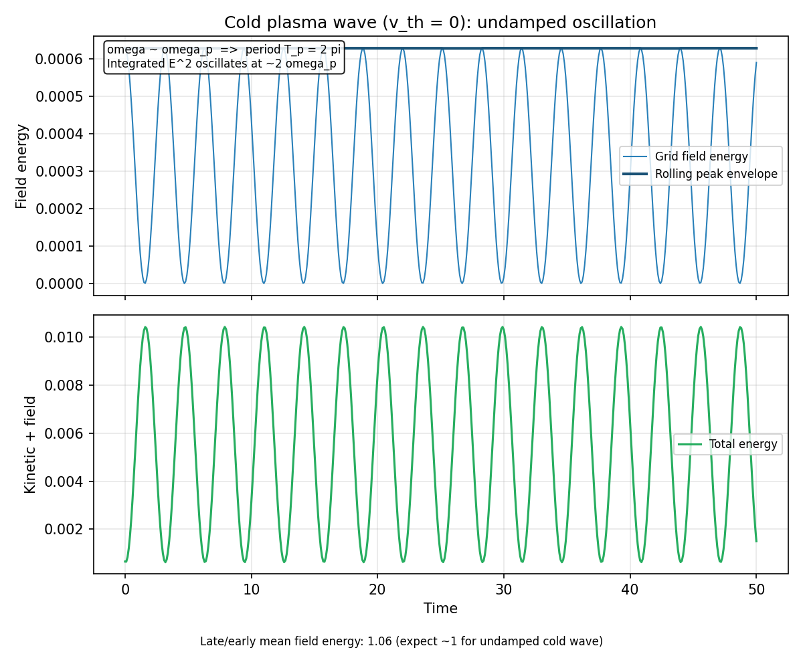
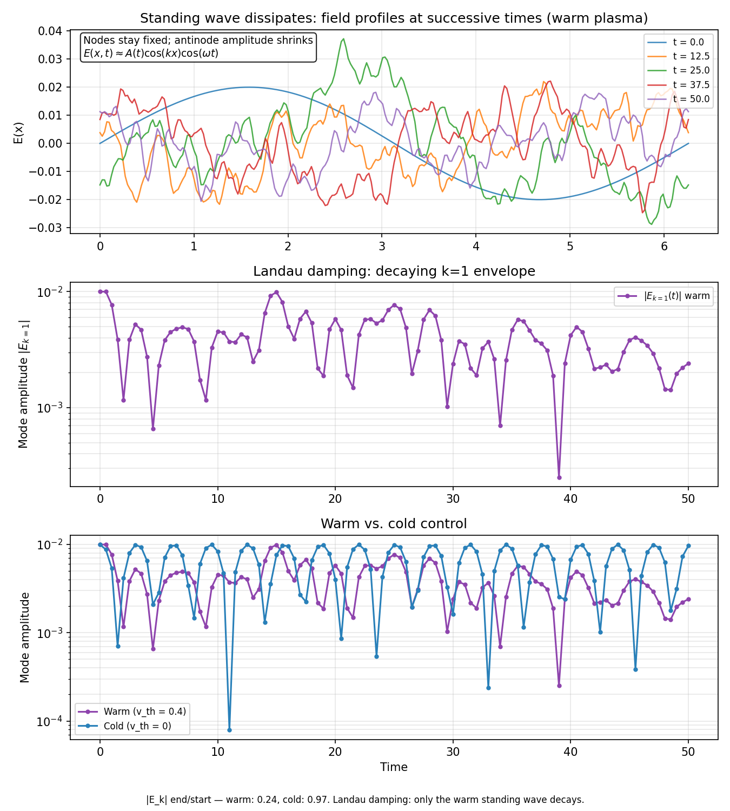

# Validation

PIC++ includes physics validation tests that exercise the full time loop and field solver for classic 1D electrostatic benchmarks: two-stream instability growth, cold-plasma wave oscillation, and warm-plasma Landau damping.

## Two-stream instability

The two-stream instability occurs when two counter-propagating cold electron beams interact in a periodic domain. A small spatial perturbation seeds growing electrostatic field energy as the beams exchange energy with the wave.

### Input

`inputFiles/validation/twoStreamInstability.json`

- Two beams with drift velocities `±1`
- `numGrid = 32`, `numTimeSteps = 500`, `timeStepSize = 0.2`
- Initial perturbation amplitude `0.001` on mode 1

### Automated checks

`test/ValidationTest.cpp` verifies:

1. **Instability growth** — final electrostatic energy is at least 5× the initial value.
2. **Energy budget** — total energy (kinetic + field) stays within 15% of its initial value over the run.
3. **Grid-size correctness** — the spectral field solver produces a non-zero field at `numGrid = 256` (regression for the former hardcoded grid size).

### Run validation tests

Build first (see [building.md](building.md)), then:

```bash
./scripts/build.sh
ctest --test-dir build --output-on-failure
```

Or run only the validation suite:

```bash
./build/bin/PIC++Main_Test --gtest_filter="ValidationTest.*"
```

### Validation plot

Generate the reference plot after building. Use the project `.venv` so the plotting
dependencies match the Python that runs the script (on macOS, bare `python3` may be a
different Homebrew Python than your `pip3`):

```bash
.venv/bin/python -m pip install -r scripts/requirements.txt
.venv/bin/python scripts/plot_two_stream_validation.py
```

The script runs `build/bin/PIC++Main` with the validation input and writes `docs/images/two_stream_validation.png`.

Override paths if needed:

```bash
python3 scripts/plot_two_stream_validation.py \
  --binary ./build/bin/PIC++Main \
  --input inputFiles/validation/twoStreamInstability.json \
  --output docs/images/two_stream_validation.png
```


### Expected behavior

- Electrostatic energy should rise sharply after the linear instability phase.
- Kinetic energy should decrease as energy transfers into the field.
- Total energy should remain roughly bounded, indicating stable long-run behavior for this benchmark.

## Cold plasma wave

A **cold** plasma has no thermal spread (**v<sub>th</sub> = 0**). When a small
**k**-mode standing wave is launched, the system supports an undamped electron
plasma oscillation. This case is the control for the Landau-damping benchmark:
identical geometry and perturbation, but without the velocity tail that enables
resonant particle absorption.

### Linear theory

For a 1D electrostatic electron plasma with uniform neutralizing background, the
linear dispersion relation for a charge-density perturbation
**δn ∝ exp(i(kx − ωt))** is the Bohm–Gross relation:

> **ω² = ω<sub>p</sub>² + 3k²v<sub>th</sub>²**

where **ω<sub>p</sub>** is the plasma frequency and **v<sub>th</sub>** is the
thermal velocity. In the **cold limit** **v<sub>th</sub> → 0**:

> **ω = ω<sub>p</sub>**

PIC++ sets **ω<sub>p</sub> = 1** via `plasmaFrequency = 1`. On a periodic domain
of length **L = 2π**, mode number **m** has wavenumber

> **k = 2πm / L** &nbsp;&nbsp;⇒&nbsp;&nbsp; **k = m** when **L = 2π**

The validation inputs use `spatialPerturbationMode = 1`, so **k = 1** and the cold
wave frequency is **ω ≈ ω<sub>p</sub> = 1**. The plasma period is

> **T<sub>p</sub> = 2π / ω<sub>p</sub> = 2π**

A **standing** wave has the separable form

> **E(x, t) = Ê<sub>k</sub> cos(kx) cos(ωt)**

so nodes stay at fixed positions while antinodes oscillate in time. PIC++ seeds
this at **t = 0** by shifting particle positions with a **sine** waveform
(`spatialPerturbationWaveform = "sin"`): a small displacement
**δx ∝ sin(kx)** creates a density perturbation **δn ∝ cos(kx)**.

Grid-integrated field energy

> **E<sub>field</sub>(t) = (Δx / 2) Σ<sub>j</sub> E<sub>j</sub>²**

oscillates at **2ω** when **E ∝ cos(kx) cos(ωt)** because of the cos² time
dependence. The envelope should remain approximately constant in a cold plasma.

### Why there is no Landau damping

Landau damping requires resonant particles at **v = v<sub>φ</sub> = ω/k**. The
linear damping rate is set by the velocity derivative of the distribution
function at the resonant speed. For a Maxwellian,

> **γ<sub>Landau</sub> ∝ (∂f/∂v)|<sub>v = v<sub>φ</sub></sub>**

For a cold plasma, **f(v) ≈ δ(v)**: there is no velocity tail at **v<sub>φ</sub>**,
so **∂f/∂v = 0** and the collisionless damping rate vanishes.

### Input

`inputFiles/validation/coldPlasmaWave.json`

Same parameters as `landauDamping.json` except `thermalVelocity = 0`:

| Parameter | Value |
|-----------|------:|
| `spatialPerturbationWaveform` | `sin` (standing-wave IC) |
| `numParticles` | 8000 |
| `spatialPerturbationMode` | 1 |
| `spatialPerturbationAmplitude` | 0.02 |
| `thermalVelocity` | **0** |
| `numGrid` | 256 |
| `numTimeSteps` / `timeStepSize` | 500 / 0.1 |

### Automated checks

`test/ValidationTest.cpp` verifies:

1. **Undamped oscillation** — late/early mean field energy stays within 90–120%
   of its early-time value (no sustained Landau decay).
2. **Warm vs. cold** (Landau section) — the warm case decays at least 10
   percentage points more than this cold control.

### Validation plot

```bash
.venv/bin/python scripts/plot_cold_plasma.py
```

Writes `docs/images/cold_plasma_wave.png`.



### Expected behavior

- **E(x, t)** keeps a fixed **cos(kx)** spatial pattern; antinode amplitude does
  not decay over many plasma periods.
- **|E<sub>k=1</sub>(t)|** stays near its initial value (see Landau comparison plot).
- Total energy approximately conserved.

## Landau damping

Landau damping is the collisionless damping of an electrostatic plasma wave:
resonant particles with velocity near the wave phase velocity
**v<sub>φ</sub> = ω/k** exchange energy with the field. In linear theory, damping
occurs when **∂f/∂v < 0** at **v = v<sub>φ</sub>** — i.e. when the resonant speed
lies on the decreasing tail of the velocity distribution. The cold-plasma control
(`inputFiles/validation/coldPlasmaWave.json`) has **v<sub>th</sub> = 0** and
therefore no Landau mechanism.

### Standing-wave initial condition

The validation case launches a **standing** electron plasma wave, not a traveling
plane wave. At **t = 0**:

> **δn(x, 0) ∝ cos(kx), &nbsp;&nbsp; v(x, 0) = 0** (+ thermal spread)

which corresponds to the field form **E(x, t) ≈ Ê<sub>k</sub>(t) cos(kx) cos(ωt)**.
PIC++ applies a sine shift to particle positions (`spatialPerturbationWaveform =
"sin"`), which to first order produces the desired cosine density mode.

As Landau damping proceeds, the envelope **Ê<sub>k</sub>(t)** decays while the
spatial pattern **cos(kx)** is preserved — nodes remain fixed and antinode
amplitudes shrink. The validation plot shows exactly this: **E(x)** curves at
successive times with decreasing peak magnitude.

### Linear theory (warm case)

For **v<sub>th</sub> > 0**, the Bohm–Gross dispersion relation gives

> **ω² = ω<sub>p</sub>² + 3k²v<sub>th</sub>²**

With **ω<sub>p</sub> = 1**, **k = 1**, and **v<sub>th</sub> = 0.4** as in the
validation input, **ω ≈ √(1 + 0.48) ≈ 1.22**, so the phase velocity is

> **v<sub>φ</sub> = ω / k ≈ 1.22**

Linear Landau theory predicts an exponential envelope decay
**|Ê<sub>k</sub>(t)| ∝ exp(−γt)** with **γ > 0** when **∂f/∂v < 0** at
**v = v<sub>φ</sub>**. For a Maxwellian **f(v) ∝ exp(−v² / 2v<sub>th</sub>²)**,

> **(∂f/∂v)|<sub>v = v<sub>φ</sub></sub> = −(v<sub>φ</sub> / v<sub>th</sub>²) f(v<sub>φ</sub>) < 0**
>
> **⇒ γ<sub>Landau</sub> > 0**

The plot script extracts **|E<sub>k=1</sub>(t)|** from saved field snapshots; this
is the quantity whose envelope should decay. PIC++ does not yet overlay the
analytic **γ<sub>Landau</sub>**; validation compares against the cold control where
**γ = 0**.

### Physical setup in PIC++

`inputFiles/validation/landauDamping.json` launches a single electron species on a
periodic domain of length **2π** with:

| Parameter | Value | Role |
|-----------|------:|------|
| `spatialPerturbationMode` | 1 | Excites **k = 1** mode (**k = 2π/L**) |
| `spatialPerturbationWaveform` | `sin` | Standing-wave density perturbation |
| `spatialPerturbationAmplitude` | 0.02 | Small sinusoidal shift of particle positions |
| `thermalVelocity` | 0.4 | Maxwellian spread (**v<sub>th</sub>**) added to velocities |
| `driftVelocity` | 0 | No net beam |
| `plasmaFrequency` | 1 | Sets **ω<sub>p</sub> = 1** in code units |
| `numParticles` | 8000 | Enough macro-particles to resolve damping |
| `numGrid` | 256 | Spectral Poisson solve (power of two) |
| `numTimeSteps` / `timeStepSize` | 500 / 0.1 | Simulates ≈ 8 plasma periods |
| `framePeriod` | 5 | Saves **E(x)** every 5 steps for the validation plot |

With **v<sub>th</sub> = 0.4**, resonant particles near **v<sub>φ</sub> ≈ 1.2** sit
on the Maxwellian tail where **∂f/∂v < 0**.

### What to look for

The validation plot (`scripts/plot_landau_damping.py`) shows three panels:

1. **E(x) snapshots** — standing-wave profiles at successive times; antinode
   amplitude shrinks while nodes stay fixed.
2. **|E<sub>k=1</sub>(t)| envelope (warm)** — log-scale decay of the **k = 1**
   Fourier amplitude (typical end/start ratio ≈ **0.25**).
3. **Warm vs. cold |E<sub>k=1</sub>(t)|** — only the warm plasma decays; the cold
   control stays near its initial amplitude.

Automated tests also track grid-integrated field energy `ese`, which oscillates at
**2ω**; the warm-vs-cold late/early mean ratio is typically **≈ 0.82** (warm) vs
**≈ 1.06** (cold).

### Automated checks

`test/ValidationTest.cpp` verifies:

1. **Field damping (warm)** — field energy rises above the initial level, then
   falls to well below its peak and below ~85% of the initial value.
2. **Energy budget (warm)** — total energy stays within 15% of its initial value.
3. **Warm vs. cold discriminator** — mean field energy in the last 100 steps is at
   least 10 percentage points lower (relative to early time) in the warm case.

### Validation plot

```bash
.venv/bin/python scripts/plot_landau_damping.py
```

The script runs **two** simulations (`landauDamping.json` warm +
`coldPlasmaWave.json` cold) and writes `docs/images/landau_damping.png`.

Override paths if needed:

```bash
.venv/bin/python scripts/plot_landau_damping.py \
  --binary ./build/bin/PIC++Main \
  --input inputFiles/validation/landauDamping.json \
  --output docs/images/landau_damping.png
```



### Expected behavior and limitations

**Expected:**

- Warm plasma: **cos(kx)** standing pattern with decaying antinode amplitude;
  **|E<sub>k=1</sub>|** falls by a factor of ~3–4 over the run.
- Cold plasma: same spatial pattern, but **|E<sub>k=1</sub>|** stays near its
  initial value.
- Total energy approximately conserved.

**Limitations (honest):**

- Qualitative 1D PIC benchmark — no analytic **γ<sub>Landau</sub>** overlay yet.
- Field energy is a tiny fraction of total kinetic energy, so the KE curve looks flat.
- Finite particle count and grid resolution set a numerical noise floor; the
  warm-vs-cold comparison isolates physical damping from that background.
