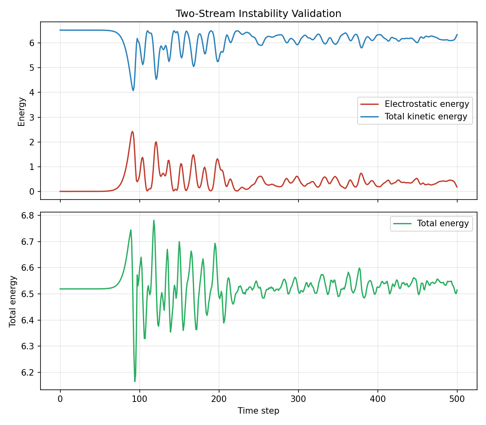

# Validation

PIC++ includes physics validation tests that exercise the full time loop and field solver.

## Two-stream instability

The two-stream instability occurs when two counter-propagating cold electron beams interact in a periodic domain. A small spatial perturbation seeds growing electrostatic field energy as the beams exchange energy with the wave.

### Input

`inputFiles/validation/twoStreamInstability.json`

- Two beams with drift velocities `±1`
- `numGrid = 32`, `numTimeSteps = 500`, `timeStepSize = 0.2`
- Initial perturbation amplitude `0.001` on mode 1

### Automated checks

`test/ValidationTest.cpp` verifies:

1. **Instability growth** — final electrostatic energy is at least 5× the initial value.
2. **Energy budget** — total energy (kinetic + field) stays within 15% of its initial value over the run.
3. **Grid-size correctness** — the spectral field solver produces a non-zero field at `numGrid = 256` (regression for the former hardcoded grid size).

### Run validation tests

Build first (see [building.md](building.md)), then:

```bash
./scripts/build.sh
ctest --test-dir build --output-on-failure
```

Or run only the validation suite:

```bash
./build/bin/PIC++Main_Test --gtest_filter="ValidationTest.*"
```

### Validation plot

Generate the reference plot after building. Use the project `.venv` so the plotting
dependencies match the Python that runs the script (on macOS, bare `python3` may be a
different Homebrew Python than your `pip3`):

```bash
.venv/bin/python -m pip install -r scripts/requirements.txt
.venv/bin/python scripts/plot_two_stream_validation.py
```

The script runs `build/bin/PIC++Main` with the validation input and writes `docs/images/two_stream_validation.png`.

Override paths if needed:

```bash
python3 scripts/plot_two_stream_validation.py \
  --binary ./build/bin/PIC++Main \
  --input inputFiles/validation/twoStreamInstability.json \
  --output docs/images/two_stream_validation.png
```



### Expected behavior

- Electrostatic energy should rise sharply after the linear instability phase.
- Kinetic energy should decrease as energy transfers into the field.
- Total energy should remain roughly bounded, indicating stable long-run behavior for this benchmark.
